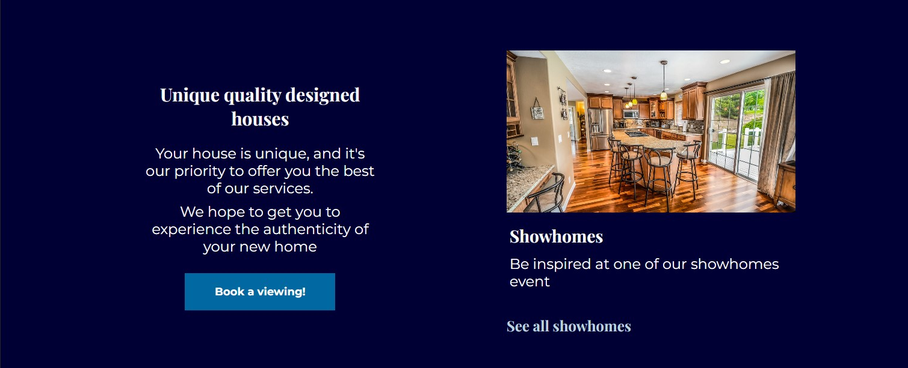
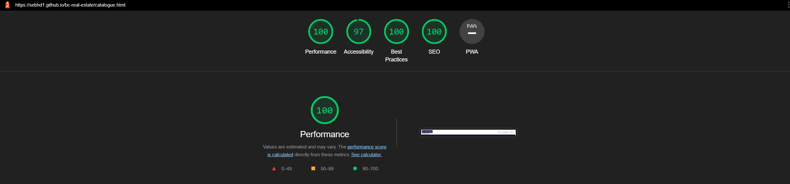
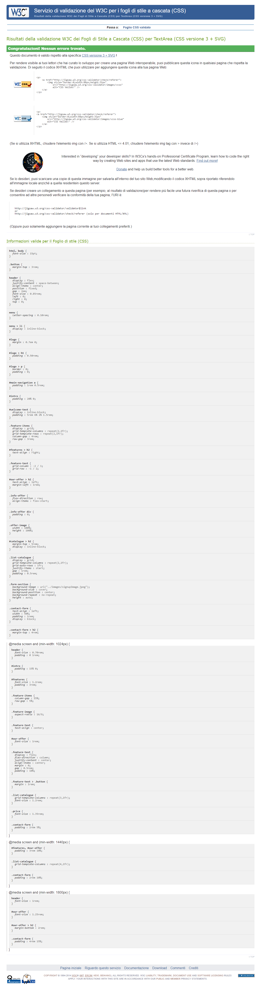
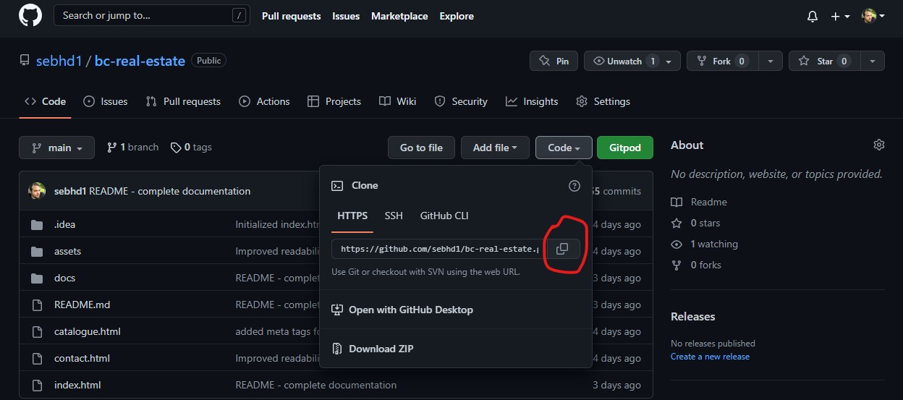

# BC Real Estate

The BC Real Estate website is a landing page for an imaginary real estate company.
The user can explore all the different sections of the landing page, and not only.
The website is composed of three separate pages all displayed in the navigation bar of the landing page.
Each page presents different features as well as different functionalities that will enhance the overall experience of the website.

## Features

In general terms, the features of this website serve two main purposes: to invite visitors to take a look around and to get inspired by some design choices. A more detailed explanation of the features is below.

### Existing Features

__Navigation Bar__

- The fully responsive navigation bar is included on all three pages. The navigation bar is kept both in style and functionality the same.
- The navigation bar is fixed to the top of the page from 768px upwards. From a small screen (320px) the navigation bar is presented as a list menu.
- It presents three clickable options: "**_Home_**", "**_Our catalogue_**", and "**_Contact Us_**".  

__The Landing page__

- The landing includes a photograph as a background image and a semi-transparent box with a clickable option that redirects the user to the catalogue page
 by clicking the "**_See Our Catalogue!_**" button.

__Features section__

- The features on the page present three clickable options: "**_Browse the catalogue_**", "**_View Locations_**", and "**_See all showhomes_**".
- The "**_Browse the catalogue_**", will redirect the user to the catalogue page.
- The "**_View Locations_**", will redirect the user to the map section, presents on the landing page.
- The "**_See all showhomes_**", will redirect the user to the contact page, where the user can send the company a specific request.
- The last feature presents a call to action **_"Book a viewing!"_** to invite people to book a viewing with the company. The clickable button will redirect the user also to the contact page.

__Help section__

This section is thought to be presented as extra services that can be offered to the customers.
The section aims to provide extra guidance and build a sense of trust in the user.

__Map section__

The map is another extra feature to add visibility to the company's imaginary location.
The map can be zoomed in and out. The location is chosen randomly, and therefore no real references are applied
as the company does not exist.

__Footer section__

In the footer section, I've included several links to four prominent social media sites for BC Real Estate.
All links when clicked, open to new tabs when clicked.

---

__Our Catalogue page__

- The Catalogue page displays all the available houses in a grid form fully responsive for all screen sizes.
- This page will give the users a little insight into what the company has to offer, therefore no clickable options are available on this page, except for the navigation bar and the footer.
- The navigation bar and the footer, follow the same style and functionalities as the home page.

---
__Contact Us page__

- The fields: "**_First Name_**", "**_Last Name_**", and "**_Email Address_**" are all mandatory fields, and therefore they cannot be left blank.
  Only the "**_Tell us your request_**" text box at the bottom of the form can be blank. It is designed to give the user the possibility to write a request if needed only.
- Upon submission by clicking on the "**_Submit_**" button, a congratulatory message appears, 
letting the user know they have submitted the form successfully. The form URL was taken from the Code Institute Love Running project and aesthetically and informationally adapted for this website.

---
## Testing

- The website itself was tested on Chrome, Safari and Firefox web browsers using a laptop computer. It was also designed to be responsive on a range of devices, using the Responsive setting on Chrome DevTools to simulate sizes.
- The social media links in the footer were tested and work correctly. All open in new tabs.
- The signup form was tested and, when filled out and submitted correctly, returns a congratulatory message noting that completion was successful.

- To complete my testing phase, I ran each page through Lighthouse in Chrome DevTools, both desktop, and mobile versions.
- Due to some Google Chrome extensions, the tests were performed in Incognito Mode.
The results are below:

Homepage (desktop and mobile)

Catalogue page (desktop and mobile)

Contact page (desktop and mobile)

---
### Validator Testing

#### HTML - test landing page 
- No errors were found when the code was passed through the official [W3C validator](https://validator.w3.org/). This was tested individually on each page.

---

#### HTML - test catalogue page
- No errors were found when the code was passed through the official [W3C validator](https://validator.w3.org/). This was tested individually on each page.

---

#### HTML - test contact page
- No errors were found when the code was passed through the official [W3C validator](https://validator.w3.org/). This was tested individually on each page.

---

#### CSS - style.css - mobile first approach to mobile large 
- I personally divided the CSS into two separated style sheets as I used the initial sheet for the mobile design mainly and the second one for the responsive.
- No errors were found when passing through the official [(Jigsaw) validator](https://jigsaw.w3.org/css-validator/)

---

#### CSS - responsive.css responsive style from tablet to large desktop 

- No errors were found when passing through the official [(Jigsaw) validator](https://jigsaw.w3.org/css-validator/)

---

## Deployment

I deployed this website to GitHub pages on the GitHub hosting platform following the steps below:

- Once in my personal GitHub repository for this project, I clicked the Settings cog button. From there I clicked "**Pages**" from the left side menu.
- Next under "**_Source_**" I selected the main branch,  refreshed the page and a link to the live site was provided, indicating successful deployment.

The live link can be found here - https://sebhd1.github.io/bc-real-estate/

### To Fork the Repository

To make a copy or ‘fork’ the repository 

- Log into GitHub and locate repository
- On the right hand side of the page select the ‘fork’ option to create and copy of the original

### To create a Local Clone

1. under the repository name, click on the ‘code’ tab
2. in the clone box, HTTPS tab, click on the clipboard icon
3. in your IDE open GitBash
4. Changed the current working directory to the location you want the cloned directory to be made
5. Type ‘git clone’ and then paste the URL copied from GitHub
6. press enter and the local clone will be created

---

## Credits

### Content

- The social media icons found in the footer were taken from [Font Awesome](https://fontawesome.com/)
- I used Stack Overflow for general troubleshooting and some responsive issues.
- The congratulatory pop-up that appears on the Get Involved page after filling out the form is also a product of Code Institute and was used solely to ensure the form worked correctly.
- The Layout inspiration for the landing page and the colors pattern were taken from [Design Builders](https://www.designbuilders.co.nz/), a huge thanks is a must.

Here a screenshot of their old website style:

### Media
- The photos used on this website are from all [Pexel.com](https://www.pexels.com/it-it/).

### Acknowledgements
This website was executed and completed as a portfolio 1 Project for the full stack diploma at [Code Institute](https://codeinstitute.net/).

Sebastiano Ballotta, 2022.