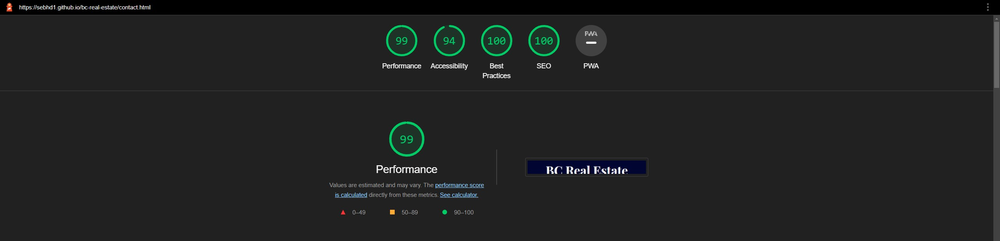

# BC Real Estate

The BC Real Estate website is a landing page for an imaginary real estate company.
The user can explore all the different sections of the landing page, and not only.
The website is composed of three separate pages all displayed in the navigation bar of the landing page. 
Each page presents different feature as well as different functionalities that will enhance the overall experience of the website.

## Features

In general terms, the features of this website serve two main purposes: to invite visitors to take a look around and to get inspired by some design choices. A more detailed explanation of the features is below.

### Existing Features

__Navigation Bar__

- The fully responsive navigation bar is included on all three pages. The navigation bar is kept both in style and functionality the same.
- The navigation bar is fixed to the top of the page from 768px onwards. From small screen (320px) the navigation bar is presented as a list menu.

__The landing page__

- The landing includes a photograph as a background image and a box with a clickable option that redirects the user to the catalogue.

__Features section__

- The three features present a clickable options: Browse the catalogue, View Locations and See all showhomes.
- The last feature presents a call to action to invite people to book a view with the company. The clickable button will redirect the user to the contact page.

__Help section__

This section is thought to be presented as extra services that can be offered to the customers. 
The aim of the section is to provide extra guidance and to build a sense of trust in the user.

__Map section__

Extra feature to add visibility for the company's imaginary location.

__Footer section__

In the footer section I've included several links to four prominent social media sites for BC Real Estate.
All links open to new tabs when clicked.

---

__Catalogue__

- The Catalogue page displays all the available houses in a grid form fully responsive for all screen sizes.
- This page will give the users a little insight regarding what the agency can offer, therefore no clickable options on this page are available, except the navigation bar and the footer.

---
__Contact Page__

- The signup form includes four mandatory fields with a submit button at the end of the form. 
- The final text box is for the user to write a special request if needed. Upon submission, a congratulatory message appears, 
letting the user know they have submitted the form successfully. The form URL was taken from the Code Institute Love Running project and aesthetically and informationally adapted for this website.

---
## Testing

- The website itself was tested on Chrome, Safari and Firefox web browsers using a laptop computer. It was also designed to be responsive on a range of devices, using the Responsive setting on Chrome DevTools to simulate sizes.
- The social media links in the footer were tested and work correctly. All open in new tabs.
- The signup form was tested and, when filled out and submitted correctly, returns a congratulatory message noting that completion was successful.

- To complete my testing phase, I ran each page through Lighthouse in Chrome DevTools, both desktop and mobile versions. The results are below:

Homepage (desktop and mobile)

Catalogue page (desktop and mobile)

Contact page (desktop and mobile)

---
### Validator Testing

HTML
- No errors were found when the code was passed through the official [W3C validator](https://validator.w3.org/nu/?doc=https%3A%2F%2Fsebhd1.github.io%2Fbc-real-estate%2F). This was tested and is true for all three pages of the website.

CSS
- No errors were found when passing through the official [(Jigsaw) validator](https://jigsaw.w3.org/css-validator/validator?uri=https%3A%2F%2Fsebhd1.github.io%2Fbc-real-estate%2F&profile=css3svg&usermedium=all&warning=1&vextwarning=&lang=it)

---
## Deployment

I deployed this website to GitHub pages on the GitHub hosting platform following the steps below:

- Once in my personal GitHub repository for this project, I clicked the Settings cog button.
- From there I clicked 'Pages' from the left side menu.
- Next under 'Source' I selected the main branch,  refreshed the page and a link to the live site was provided, indicating successful deployment.

The live link can be found here - https://sebhd1.github.io/bc-real-estate/

## Credits

---
### Content

- The social media icons found in the footer were taken from [Font Awesome](https://fontawesome.com/)
- I used Stack Overflow for general troubleshooting.
- The congratulatory pop-up that appears on the Get Involved page after filling out the form is also a product of Code Institute and was used solely to ensure the form worked correctly.

### Media

- The photos used on this website are from [Pexel.com](https://www.pexels.com/it-it/).
  
